# RiskWise: Procurement Risk Analysis System
<p align="center">
  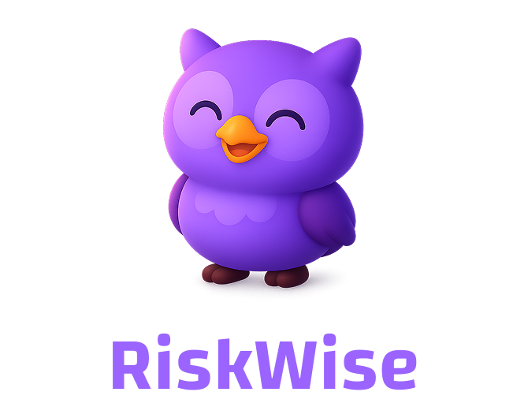
</p>

## Overview
RiskWise is a proof-of-concept Agentic AI application built for today's volatile global landscape, designed to support expeditors with near real-time, explainable market and risk intelligence across global supply chains. Instead of replacing human decision-makers, RiskWise acts as an intelligent assistant — continuously monitoring geopolitical events, labor conditions, tariffs, and logistics disruptions to surface early warnings. Expeditors can ask natural language questions and receive structured, visual insights grounded in current data and verified sources. It is a multi-agent AI system that transforms how organizations manage equipment delivery risks across global supply chains. By leveraging Azure AI Projects and specialized AI agents, it delivers comprehensive risk assessment by analyzing:

- **Schedule variances** - Identifying delivery timeline risks
- **Political factors** - Real-time geopolitical risk insights via Bing Search
- **Tariff changes** - Monitoring trade policy impacts on procurement
- **Logistics disruptions** - Tracking shipping and transportation challenges

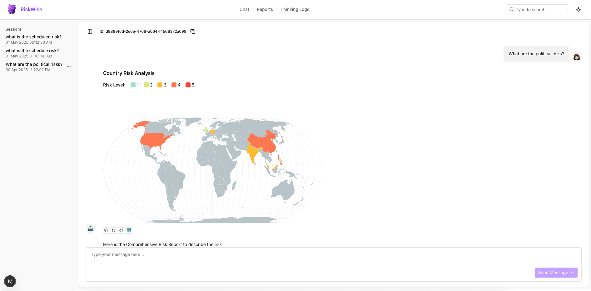

## Business Impact

RiskWise solves critical business challenges by:

- **Preventing costly delays** - Proactively identify equipment delivery risks before they impact projects
- **Providing early warning** - Get timely alerts on emerging political, tariff, and logistics issues
- **Simplifying collaboration** - Create shareable, structured documentation for procurement teams
- **Supporting data-driven decisions** - Make procurement choices backed by comprehensive risk analysis
- **Reducing supply chain disruptions** - Address potential issues before they affect project timelines

## Key Features

### Intelligent Multi-Agent Analysis
- Specialized agents collaborate to deliver comprehensive risk assessment
- Each agent focuses on specific risk domains (schedule, political, tariff, logistics)
- Consolidated reporting synthesizes insights into actionable recommendations

### Interactive Risk Analysis
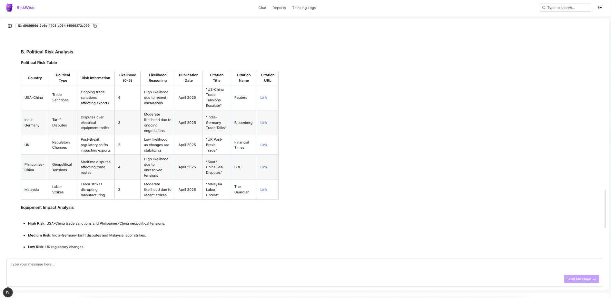
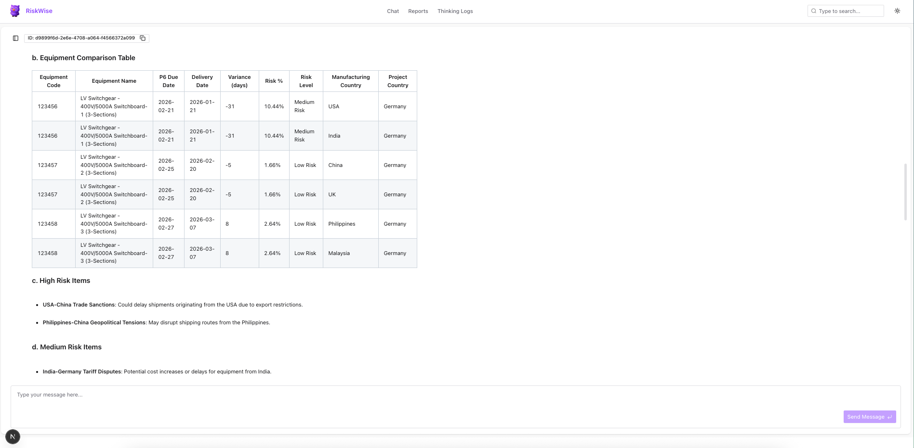

- Conversational interface for natural risk queries and analysis
- Real-time political risk intelligence using Bing Search integration
- Automatic calculation of schedule variances and risk levels
- Detailed recommendations for risk mitigation

### Professional Report Generation
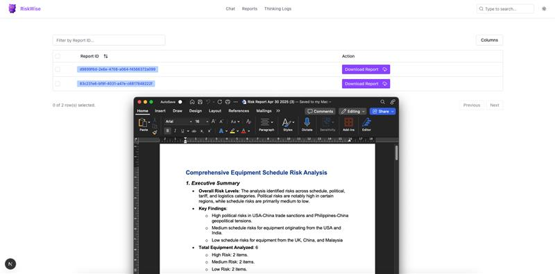

- Automatically generate formatted Word documents with risk analysis
- Store reports centrally in Azure Storage for easy access
- Track report history and filter by project, equipment, or date
- Share reports with stakeholders via secure download links

### Advanced Visualization
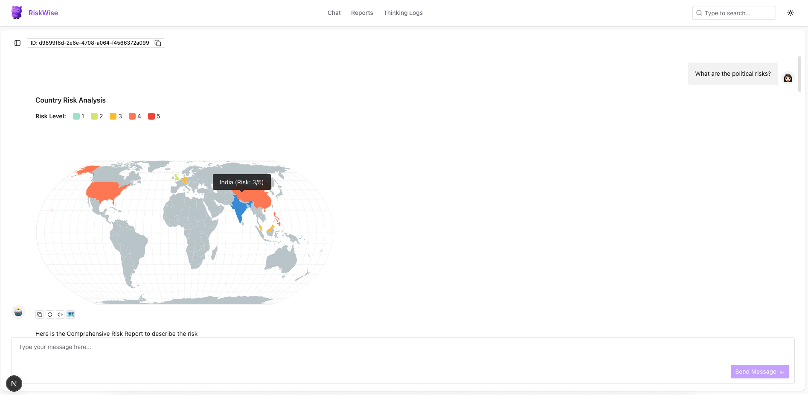

- Interactive heatmaps showing risk distribution by country
- Schedule variance charts highlighting delivery timeline issues
- Risk impact assessment matrices for severity understanding
- Trend analysis to identify emerging risk patterns

### Transparent AI Reasoning
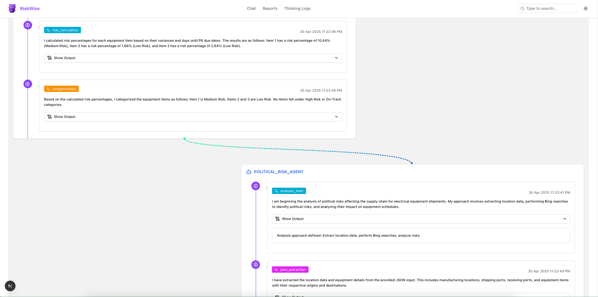

- Complete visibility into AI decision processes
- Verification of information sources with citation tracking
- Comprehensive audit trail of system operations
- Identify reasoning behind specific recommendations

### Developer View via Streamlit
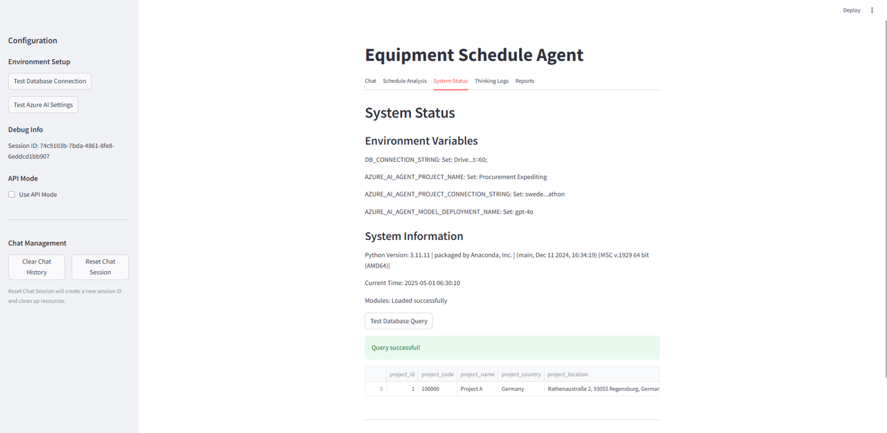
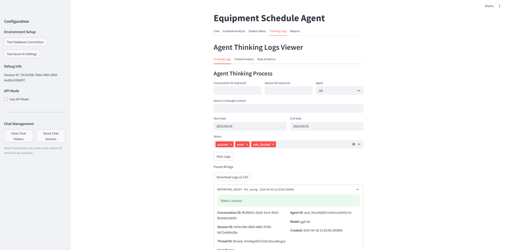
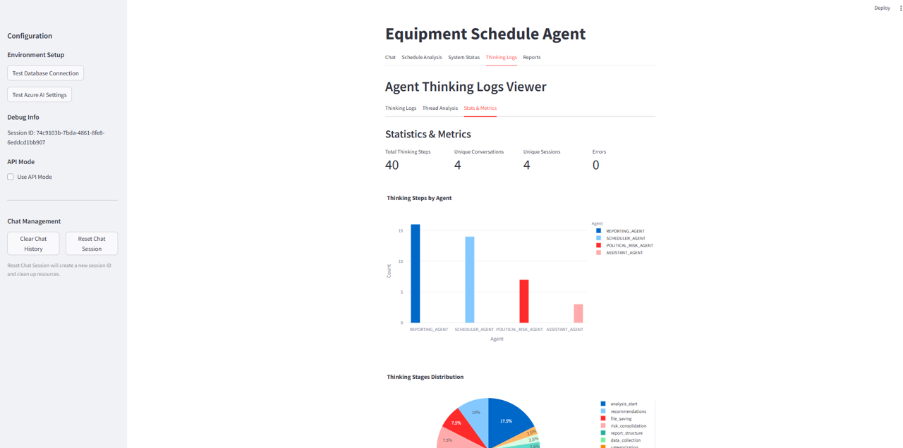
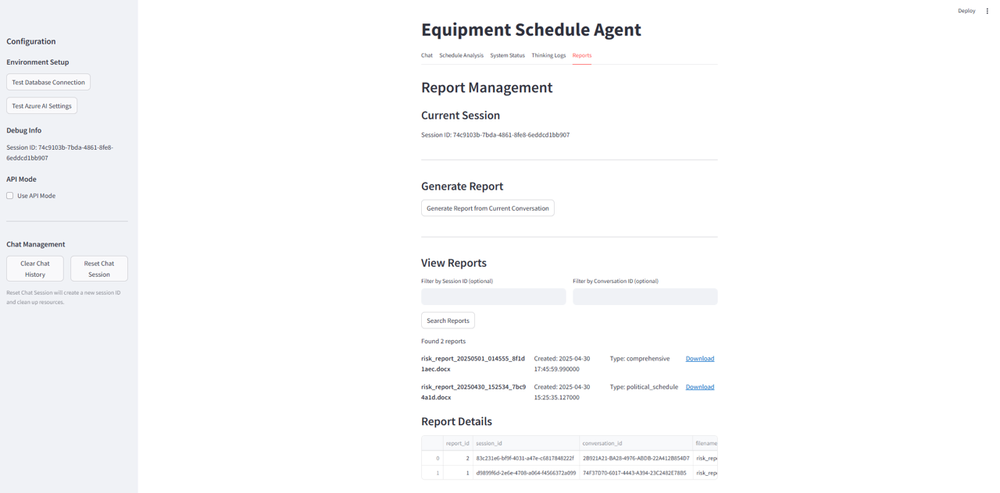
- **System Testing Dashboard**: Interactive UI to validate Azure connections and database settings
- **Environment Diagnostics**: Visual indicators for successful connection tests
- **Error Visualization**: User-friendly display of system errors and troubleshooting guidance
- **Session Management**: View active sessions and conversation IDs for debugging
- **Thinking Log Explorer**: Interactive tool for examining agent reasoning in detail

The Developer View is built directly into the Streamlit interface, providing a convenient way for developers to test, monitor, and troubleshoot the system without requiring separate tools or command-line access.

## System Components
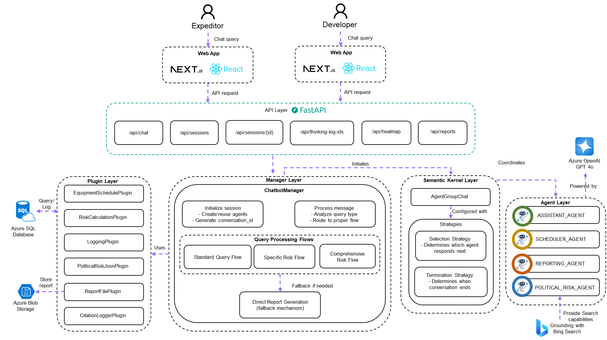

The system consists of several interrelated components that work together to provide comprehensive risk analysis.

## Azure Technologies Used

- **Azure AI Agent Service** - Foundation for creating and orchestrating specialized agents
- **Azure OpenAI Service** - Powerful language models driving intelligent analysis
- **Grounding with Bing Search** - Real-time access to global events and political developments
- **Azure Storage** - Secure document management and report storage
- **Azure SQL Database** - Structured data storage and analytics capabilities

## System Architecture

The system follows a modular, multi-agent design pattern:

### Agent Layer
- **Scheduler Agent** - Processes equipment data, calculates variances, determines risk levels
- **Political Risk Agent** - Identifies geopolitical factors affecting supply chains
- **Reporting Agent** - Consolidates findings into structured, actionable reports
- **Assistant Agent** - Manages conversation flow and user interaction

### Manager Layer
- **Chatbot Manager** - Orchestrates agent interaction for chat sessions

### Plugin Layer
- **Schedule Plugin** - Processes equipment schedule data
- **Risk Plugin** - Performs calculation and categorization
- **Logging Plugin** - Manages agent thinking and events
- **Report File Plugin** - Generates Word documents and handles storage
- **Citation Handler Plugin** - Tracks citations from Bing Search results

### API & Interface Layer
- **FastAPI Application** - RESTful endpoints for system integration
- **Streamlit Interface** - Interactive user experience for developers during development

## Quick Start

### Prerequisites

- Python 3.11
- Azure AI Projects account with model deployment
- SQL Server database
- Azure Storage account (for report storage)
- Bing Search API key (for political risk analysis)

### Installation

```bash
# Clone repository
git clone https://github.com/yourusername/procurement-risk-analysis.git
cd procurement-risk-analysis

# Create and activate virtual environment
python -m venv .venv
source .venv/bin/activate  # On Windows: .venv\Scripts\activate

# Install dependencies
pip install -r backend/requirements.txt
```

### Environment Setup

Create a `.env` file with your configuration:

```
AZURE_AI_AGENT_PROJECT_CONNECTION_STRING=your_connection_string
AZURE_AI_AGENT_MODEL_DEPLOYMENT_NAME=your_model_deployment
DB_CONNECTION_STRING=your_db_connection_string
AZURE_STORAGE_CONNECTION_STRING=your_storage_connection_string
BING_SEARCH_API_KEY=your_bing_api_key
```

### Running the Application

```bash
# Start the API server
cd backend
python main.py

# OR start the Streamlit interface
streamlit run streamlit_app.py
```

## Project Structure
```
frontend/
├── app/ # Next.js app directory (pages and routing)
├── components/ # Reusable React components
├── hooks/ # Custom React hooks
├── lib/ # Utility functions and shared logic
├── public/ # Static assets
├── .next/ # Next.js build output
├── node_modules/ # Dependencies
├── tailwind.config.js # Tailwind CSS configuration
├── tsconfig.json # TypeScript configuration
├── next.config.ts # Next.js configuration
├── postcss.config.mjs # PostCSS configuration
├── package.json # Project dependencies and scripts
└── eslint.config.mjs # ESLint configuration
```

```
backend/
├── agents/                    # Agent definitions and strategies
│   ├── agent_definitions.py   # Instructions for each specialized agent
│   ├── agent_manager.py       # Agent creation and management functions
│   └── agent_strategies.py    # Selection and termination logic for agent groups
├── api/                       # API components
│   ├── app.py                 # FastAPI application setup
│   ├── endpoints.py           # API route definitions
│   └── api_server.py          # Standalone API server
├── config/                    # Configuration components
│   ├── settings.py            # Environment and application settings
│   └── __init__.py            # Configuration module initialization
├── managers/                  # System managers
│   ├── chatbot_manager.py     # Chat interaction handling
│   ├── scheduler.py           # Workflow scheduling
│   └── workflow_manager.py    # Automated workflow management
├── plugins/                   # Semantic Kernel plugins
│   ├── citation_handler_plugin.py   # Citation extraction and formatting
│   ├── logging_plugin.py            # Thinking and event logging
│   ├── political_risk_json_plugin.py # Political risk data processing
│   ├── report_file_plugin.py        # Report generation and storage
│   ├── risk_plugin.py               # Risk calculation functions
│   └── schedule_plugin.py           # Schedule data retrieval and processing
├── utils/                     # Utility functions
│   ├── database_utils.py      # Database connection management
│   └── thinking_log_viewer.py # Streamlit component for viewing agent thinking
├── main.py                    # Application entry point
├── streamlit_app.py           # Streamlit UI application
└── requirements.txt           # Project dependencies
```

## Implementation Highlights

This project was developed for the AI Agents Hackathon 2025 and features:

- **Agent Collaboration Framework** - Sophisticated orchestration allowing specialized agents to work together
- **Thinking Transparency** - Comprehensive logging of agent reasoning for auditability
- **Dynamic Instruction Management** - Agent instructions that adapt based on query type and context
- **Fault Tolerance** - Resilient error recovery to maintain operation despite agent failures

## License

This project is licensed under the Apache License 2.0 - see the [LICENSE](LICENSE) file for details.

```
Copyright 2025 [Your Name/Organization]

Licensed under the Apache License, Version 2.0 (the "License");
you may not use this file except in compliance with the License.
You may obtain a copy of the License at

    http://www.apache.org/licenses/LICENSE-2.0

Unless required by applicable law or agreed to in writing, software
distributed under the License is distributed on an "AS IS" BASIS,
WITHOUT WARRANTIES OR CONDITIONS OF ANY KIND, either express or implied.
See the License for the specific language governing permissions and
limitations under the License.
```
